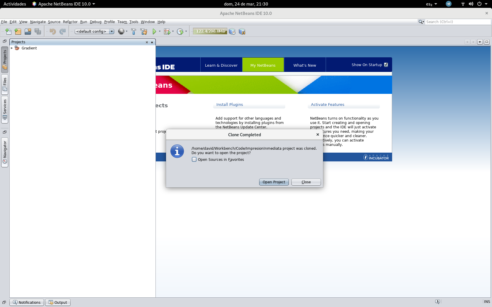

# Clonando un proyecto desde GitHub o Gitlab en NetBeans

Ya sea por que apenas se unió propiamente al equipo de desarrollo o por que desea trabajar desde otro equipo una de las primeras cosas que necesitara hacer es bajar el proyecto desde GitHub o Gitlab, ¿Como se hace esto?, aquí le digo.

## Clonando un proyecto Git
Al proceso de tomar un proyecto que esta en un repositorio remoto y copiarlo junto a su historial de versiones y cambios se conoce como clonar, esto lo puede hacer no solo con repositorios remotos que usted creo sino también con repositorios públicos.

Para clonar un repositorio necesita obtener el URL del repositorio, dependiendo del servicio este esta en una ubicación diferente como se ven en las imagenes,

Notara que se le presenta una opción para clonar via SSH o HTTPS, usaremos HTTPS ya que es la mas común.

Ya que tenga la URL vaya al menú Equipo->Git->Clonar

Esto nos desplegara un dialogo para poner la información del repositorio, la URL y nuestro usuario y contraseña, estos dos últimos son opcionales si nada mas estamos clonando un repositorio publico y obligatorios si somos parte del equipo que puede colaborar con ese proyecto.

Le puede aparecer un mensaje preguntando si desea usar una contraseña maestra o no, es opcional, siéntase libre de ignorarlo.

Despues se le preguntara que ramas desea clonar (de modo que no tenga que copiar todo si no va a trabajar en esas ramas)

Luego se le pedirá que especifique el directorio donde desea se guarde el proyecto, la rama que este seleccionada al iniciar y como se llamara el repositorio remoto del que esta clonando.

Hecho esto NetBeans le preguntara si desea abrir el proyecto recién clonado.

Y listo, el proyecto esta listo para trabajar

